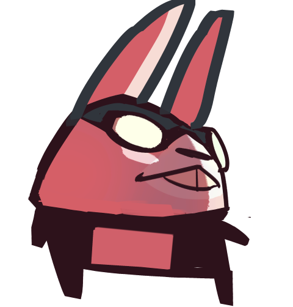
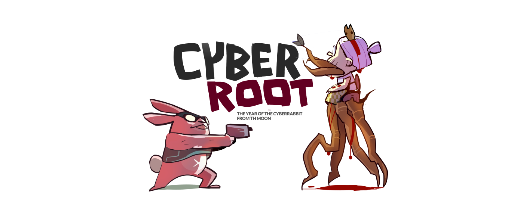
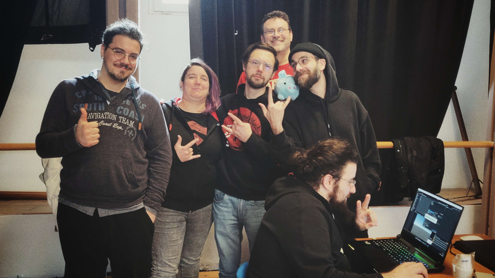

# CyberRoot 7022 - The Year of the CyberRabbit from the Moon

Global Game Jam 2023 entry.

_"We don't take it seriously and we know it!"_

## About

Year 7022 AD. The Earth is fully inhabitated, buildings are everywhere, the surface is totally wired by thick, ultra-wide, huge fibre cables. Finally!
Evil Grandma is the only human against high speed internet and progress. To stop the growth of civilization she conjured the Obscure Spirits of the Underground, becoming one with the Roots of All Evil.
Sensing the incoming danger, the Council of Highspeed Torrent Downloads gathered to summon you, the CyberRabbit from the Moon. Diving from the Earth's favourite satellite, you'll reach the Earth fighting the Evil Roots, with your only friend: the EBFG.

Will you make it?
Yes. (There is no Lose Condition)

The best game ever made during a Global Game Jam in the last 50 minutes before the upload.
47 hours playing games, 1h developing. That's our secret.

## Images

## Jam Stats

|                        |                                                                                                                                                                                                                                                                                                                                                                                                                                                                                                                                                                                                                                                                     |
| ---------------------- | ------------------------------------------------------------------------------------------------------------------------------------------------------------------------------------------------------------------------------------------------------------------------------------------------------------------------------------------------------------------------------------------------------------------------------------------------------------------------------------------------------------------------------------------------------------------------------------------------------------------------------------------------------------------- |
| Year                   | 2023                                                                                                                                                                                                                                                                                                                                                                                                                                                                                                                                                                                                                                                                |
| Location               | Pisa, Italy                                                                                                                                                                                                                                                                                                                                                                                                                                                                                                                                                                                                                                                         |
| Diversifiers           | **Making memories (Sponsored by dot big bang):** Create a game that has at least one moment that everyone who plays it will remember. It could be something delightful, a jump scare, an epic climax, an epiphany, but make it memorable! **Sharing is caring (Sponsored by GitHub):** Share the source code for your submission in a public GitHub repository and list the URL on your submission page. **Year of the Rabbit:** Make a game that has rabbits as an element in it, or showcases how your culture/locals celebrate the Year of the Rabbit, or make a game featuring cats for our Vietnamese friends who are celebrating the Year of the Cat. |
| Tools and Technologies | Unity                                                                                                                                                                                                                                                                                                                                                                                                                                                                                                                                                                                                                                                               |
| Tags                   | 3D First-Person                                                                                                                                                                                                                                                                                                                                                                                                                                                                                                                                                                                                                                                 |

## Team

Our **motto**, on repeat every 4 hours: "Let's make a game this time!" - _everyone laugh and leaves_

From left to right

| Person             | Role                                                        | Links                                                                                            |
| ------------------ | ----------------------------------------------------------- | ------------------------------------------------------------------------------------------------ |
| Michele Ribechini  | Game Design   Sound Performer   Jammer impersonator |                                                                                                  |
| Ilaria Baldassari  | Concept Artist   Root 2d projector                      | [GitHub](https://github.com/sheirafenix) [Instagram](https://www.instagram.com/sheira_fenix) |
| Michele Lanzo      | Game Design   Lore crafter                              | [GitHub](https://github.com/m-lanzo)                                                             |
| Andrea Cianfanelli | Assistant Programmer   Rotation Expert                  | [GitHub](https://github.com/cinfa78)                                                             |
| Giacomo Guccinelli | Concept Artist   Tegame Illustrato                      | [Instagram](https://www.instagram.com/lateogoniaillustrata)                                      |
| Nicolò Renzoni     | Programmer   Useless prototype creator                  | [GitHub](https://github.com/klausrenzo) [Instagram](https://www.instagram.com/klausrenzo)    |
